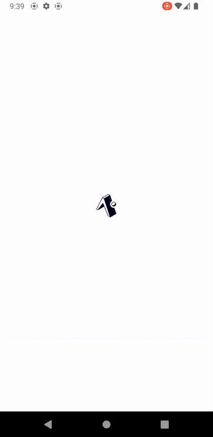

<p align="center">
  <image src="./.github/images/discord-logo.png" alt="Discord" width="250px" />

  <p align="center">Discord UI Clone make with Expo</p>

</p>

## Table of contents

- [Preview](#preview)
- [Technologies](#technologies)
- [Installation](#installation)
- [Download Android Package](#download-android-package)
- [Author](#author)

## Preview

---

<p align="center">
  
</p>

## Technologies

---

The follows tools were used on project build:

- **Expo**
- **React Native**
- **TypeScript**
- **styled-components**

## Installation

---

First clone the repository in your computer:

```
  git clone https://github.com/jjuliomarttins/discord-expo.git
```

Install all dependencies with `npm install` or `yarn`:

Run the local build with command `expo run:android` or `expo run:ios`

or run `expo start`, but the date-picker does not work.

## Download Android Package

If you have a Android phone or Android Emulator installed in your computer, you can download the Apk in this link.

<p align="center">
  <a href="https://expo.dev/artifacts/eas/a96nwcQu4gfYGdnpUMH2SB.apk">
    
  </a>
</p>

## Author

---


<br />
<sub><b>Julio Martins</b></sub></a>

Make by Julio Martins 👋🏽 Contact me!

[](https://www.linkedin.com/in/jjuliomarttins/)
